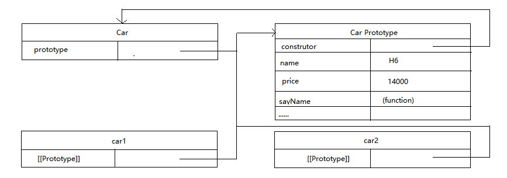

# JavaScript原型与原型链

| 标题 | 内容 |
| --- | --- |
| 工厂模式 | JavaScript并不支持工厂模式(略读) |
| 构造函数 | 构造函数的介绍 |
| 原型 | 我们创建的每个函数都有一个`prototype`(原型)属性，这个属性是一个指针，指向一个对象，而这个对象的用途是包含可以由特定类型的所有实例共享的属性和方法。 |
| 原型链 | 原型链的实现  |
| 继承 | JavaScript继承的实现 |
| ES6类 | ES6类的实现  |
| ES6类的继承  | ES6类的继承实现 |


------


## 工厂模式-Factory Pattern

- 虽然**Object构造函数**或者**对象字面量**都可以用来创建单个对象，但这些方式有个明显的缺点: 使用**同一个接口创建很多对象**，会产生大量的重复代码。为解决这个问题，人们开始使用工厂模式的一种变体。

### Object构造函数

- `Object`**构造函数**将给定的值包装为一个新对象。 

```javascript
// 如果给定的值是null或者undefined, 它会创建并返回一个空对象。
// 否则, 它们返回一个和给定的值相对应的类型的对象。
// 如果给定值是一个已经存在的对象，则会返回这个已经存在的值（相同地址）。
new Object();
new Object(value); // value 任意值

let o = new Object();
o.foo = 25;

console.log(o);
// Object { foo:25 }

let o = new Object();

let o = new Object(undefined);

let o = new Object(null);
```

------

### 对象字面量


- 在**非构造函数上下文中**调用时，`Object`和`new Object()`表现一致。

- 工厂模式是软件工程领域一种广为人知的设计模式，这种模式抽象了创建具体对象的过程。

- 工厂顾名思义就是**创建产品** —— *比如：你要买一辆HAVAL H6，你直接去HAVAL店里面买一台就行了，但是HAVAL厂家要在工厂里面做好一辆HAVAL H6(制造HAVAL H6的过程)，交付给客户。* ，根据产品是具体产品还是具体工厂可分为**简单工厂模式**和**工厂方法模式**，根据工厂的抽象程度可分为**工厂方法模式**和**抽象工厂模式**。该模式用于封装和管理对象的创建，是一种创建型模式。

### 工厂模式主要思想

- 工厂模式主要思想是将**对象的创建**与**对象的实现**分离。
- 工程模式是一种**关注对象创建概念的模式**。

### 什么时候需要工厂模式

- 当我们的**对象**或者**组件**设置涉及到**高程度级别的复杂度**。什么时候算得上是高程度的复杂度了？其实就是前面所说的制造一辆HAVAL H6。
- 实例对象比较复杂的情况下适用工厂模式，多对象，适用于共同属性的对象，工厂模式可以成批量地生产模式。


### 简单工厂模式-Simple Factory Pattern
- 简单工厂模式（Simple Factory），又叫**静态工厂方法**，由一个**工厂对象**来决定创建某一种产品对象类的实例，主要用来创建同一类对象。
- 该模式对**对象创建管理方式**最为简单，因为其仅仅简单的对**不同类对象的创建进行了一层薄薄的封装**。该模式通过向**工厂传递类型**来指定要**创建的对象**。如下: 以下是`TypeScript`代码。


#### 汽车类: 汽车标准规范类(Car)
```typescript
abstract class Car {
  public abstract make(): void;
  public abstract sale(): void;
}
```

#### HAVAL H6类: 制造HAVAL H6汽车()
```typescript
public class H6Car extends Car {  
  // @Override
  public make(): void {
    console.log("make haval 6 car");
  }

  public show(): void {
    console.log("sale haval 6 car");
  }
}
```

#### HAVAL H9类: 制造HAVAL H9汽车
```typescript
public class H9Car implements Car {
  // @Override
  public make(): void {
    console.log("make haval 9 car");
  }

  public show(): void {
    console.log("sale haval 9 car");
  }
}
```

#### CarFactory类: 汽车代工厂(Factory)
```typescript
public class CarFactory {
  /**
   * 静态工厂方法
   * @param carType 限制传入的参数为类，而非类的实例
  */
  constructor(name: string, price: number) { }
  public static createCar(carType: new() => Car): Car {
    let car = null;

    try {
      car = new carType();
    } catch(e) {
      console.error("Created failed!");
    }

    return car;
  }
}
```

#### Example
```typescript
let car = CarFactory.createCar(H6Car);
car.make();

car = CarFactory.createCar(H9Car);
car.make();
```

### 工厂方法模式-Factory Method Pattern
- 工厂方法模式，通过对**产品类的抽象**使**其创造业务只要负责用户创建多类产品的实例**。 
- 和简单工厂模式中工厂负责生产所有产品相比，工厂方法模式将**生产具体产品的任务**分发给**具体的产品工厂**，如图所示:


- 也就是定义一个抽象工厂，其定义了产品的生产接口，但不负责具体的产品，将生产任务交给不同的派生类工厂。这样不用通过指定类型来创建对象了。

```typescript
```

------

## JavaScript 工厂模式

- 对于使用过基于类的语言(如Java或C++)的开发人员来说，JavaScript有点令人困惑，因为它是动态的，并且本身不提供一个`class`实现。(在ES2015/ES6中引入了`class`关键字，ES6的`class`可以看作只是一个**语法糖**，它的绝大部分功能，`ES5`都可以做到，新的`class`写法只是让**对象原型**的写法更加清晰、更像**面向对象编程的语法**而已。JavaScript仍然是基于原型的)。

- 考虑到在ECMAScript中无法创建类，ECMAScript开发人员就发明了一种函数，用**函数来封装以特定接口创建对象**的细节，如下所示:

```javascript
/**
 * @param prototype
 * @description object that provides shared properties for other objects
 * @note When a constructor creates an object, that object implicitly references the constructor's
 * prototype property for the purpose of resolving property references. The constructor's
 * prototype property can be referenced by the program expression
 * `constructor.prototype`, and properties added to an object's prototype are shared, through
 * inheritance, by all objects sharing the prototype. Alternatively, a new object may be created with
 * an explicitly specified prototype by using the Object.create built-in function.
*/
function createCar(name, price) {
  var obj = new Object();
  obj.name = name;
  obj.price = price;
  obj.sayName = function() {
    console.log(this.name);
  };
  return obj;
}
/**
 * @description 函数`createCar()`能够根据接受的参数来构建一个包含所有必要信息的`Car`对象。
 * 可以无数次调用这个函数，而每次它都会返回一个包含三个属性一个方法的对象。
 * 无数次调用: car1, car2, ..., carN都可以调用这个函数。
*/

let car1 = createCar("H6", 140000);
let car2 = createCar("H9", 400000);
console.log(car1);
console.log(car2);
```

- 这个时候`createCar`就类似于一个创造汽车的工厂一样，工厂模式虽然解决了**创建多个相似对象**的问题，但却没有解决**对象识别的问题**，也就是说我**怎么知道一个对象的类型？**。
- 随着JavaScript的发展，又一个新模式出现。

------

## 构造函数 Constructor

- `ECMAScript`中的构造函数可用来**创建特定类型的对象**。
- 像`Object`和`Array`的原生构造函数，在运行时会自动出现在执行环境中。
- 此外，也可以创建自定义的构造函数，从而定义自定义对象类型的属性和方法。
- 例如，可以使用构造函数模式将前面的例子重写如下：

```javascript
/**
 * @description Car()函数取代了createCar()函数。
 * Car()中的代码除了与createCar()中相同的部分外，还存在一下不同之处:
 *   1. 没有显式地创建对象;
 *   2. 直接将属性和方法赋给了this对象;
 *   3. 没有return语句。
 * @name Car
 * @param {*} name
 * @param {*} price
*/
function Car(name, price) {
  this.name = name;
  this.price = price;
  this.sayName = function () {
    console.log(this.name);
  }
}

let car1 = new Car("H6", 140000);
let car2 = new Car("H9", 400000);
console.log(car1);
console.log(car2);
```

- 我们应该注意到函数名Car使用的大写字母*C*。按照惯例，**构造函数始终都应该以一个大写字母开头**，而**非构造函数则应该以一个小写字母开头**。(参照的是OO语言——面向对象(Object Oriented,OO))，主要是为了区别于ECMAScript中的其他函数；因为构造函数本身也是函数，只不过可以用来创建对象而已。

- 注意：我们要创建Car的新实例，必须使用`new`操作符。`new`操作符调用构造函数实际上经历了什么了？如下:

```javascript
/**
 * @description new过程经历了以下4个步骤:
 * 1. 创建一个新对象;
 * 2. 将构造函数的作用域赋给新对象（因此this就指向了这个新对象）;
 * 3. 执行构造函数中的代码（为这个新对象添加属性）;
 * 4. 返回新对象。
*/
let car1 = new Car("H6", 140000);
let car2 = new Car("H9", 400000);
```

- 在上面例子的最后，`car1`和`car2`分别保存着`Car`的一个不同的实例。这两个对象都有一个`constructor`(构造函数)属性，该属性指向`Car`, 如下所示:

```javascript
/**
 * @description 对象的constructor属性最初是用来标识对象类型的。
*/
console.log(car1.constructor == Car); // true
console.log(car2.constructor == Car); // true
```

- 对象的constructor属性最初是用来标识对象类型的。但是，提到检测对象类型，还是`instanceof`操作符要更可靠一些。

```javascript
/**
 * @description 对象car1和car2既是Object的实例(这是因为所有对象均继承自Object)，同时也是Car的实例。
 * 这一点通过instanceof操作符可以得到验证。
*/
console.log(car1 instanceof Object); // true
console.log(car1 instanceof Car); // true
console.log(car2 instanceof Object); // true
console.log(car2 instanceof Car); // true

console.log(car1.constructor == Car); // true
console.log(car1.constructor == Object); // false
console.log(car2.constructor == Car); // true
console.log(car2.constructor == Object); // false
```

### 创建自定义的构造函数
- 创建自定义的构造函数(`constructor`)意味着将来可以将它的实例标识为一种特定的类型; 而这正是构造函数模式胜过工厂模式的地方。

#### 将构造函数当作函数

- 构造函数与其他函数的唯一区别，就在于**调用它们的方式不同**。不过，构造函数毕竟也是函数，不存在定义构造函数的特殊语法。
- 任何函数，只要通过`new`操作符来调用，那它就可以作为构造函数; 而任何函数，如果不通过`new`操作符来调用，那它跟普通函数也不会有什么两样。

```javascript
/**
 * @description 当作构造函数使用
*/
let car = new Car("H6", 140000);
car.sayName(); // "H6"

/**
 * @description 作为普通函数调用
*/
Car("H9", 400000);
window.sayName(); // "H9"

/**
 * @description 在另一个对象的作用域中调用
*/
let o = new Object();
Car.call(o, "H大狗", 30000); // Function.prototype.call();
o.sayName(); // "H大狗"
/**
 * @description 构造函数的典型用法: 使用new操作符来创建一个新对象。
 * let car = new Car("H6", 140000);
 * car.sayName(); // "H6"
 * 
 * 不使用new操作符调用Car(): 属性和方法都被添加给window对象了。
 * 当在全局作用域中调用一个函数时，this对象总是指向Global对象(在浏览器中就是window对象).
 * Car("H9", 400000);
 * window.sayName(); // "H9"
 * 在调用完函数之后, 可以通过window对象来调用sayName()方法, 并且还返回了"H9"。
 * 
 * 最后, 也可以使用call()(或者apply())在某个特殊对象的作用域中调用Car()函数。
 * let o = new Object();
 * Car.call(o, "H大狗", 30000); // Function.prototype.call();
 * o.sayName(); // "H大狗"
 * 
 * 这里是在对象o的作用域中调用的，因此调用后o就用了所有属性和sayName()方法。
*/
```

#### 构造函数的问题
- 构造函数模式虽然好用，但也并非没有缺点。使用构造函数的主要问题，就是**每个方法都要在每个实例上重新创建一遍**。

```javascript
/**
 * @description car1和car2都有一个名为sayName()的方法, 但car1和car2还不是同一个Function的实例。
*/
let car1 = new Car("H6", 140000);
let car2 = new Car("H9", 400000);
```

- 注意了，ECMAScript中的函数是对象(), 因此每定义一个函数，也就是实例化了一个对象。所以从逻辑角度讲，此时的构造函数也可以这样定义。

```javascript
/**
 * @desciption 下面代码更容易明白每个Car实例都包含一个不同的Function实例(以显示name属性)的本质。
*/
function Car(name, price) {
  this.name = name;
  this.price = price;
  this.sayName = new Function("console.log(this.name)"); // 与声明函数在逻辑上是等价的
}

/**
 * @description 上面代码创建函数会导致不同的作用域链和标识解析，但创建Function新实例的机制仍然是相同的。
 * 因此, 不同实例上的同名函数是不相等的。
*/
console.log(car1.sayName == car2.sayName); // false
```

- 但是, 创建两个完成同样任务的Function实例的确没有必要; 况且有`this`对象在, 根本不用在执行代码前就把函数绑定到特定对象上面。因此, 可以像下面这样, 通过把函数定义转移到构造函数外部来解决这个问题。

```javascript
/**
 * @description 把sayName()函数的定义转移到了构造函数外部。
 * 而在构造函数内部，我们将sayName属性设置成等于全局的sayName函数。
*/
function Car(name, price) {
  this.name = name;
  this.price = price;
  this.sayName = sayName;
}

function sayName() {
  console.log(this.name);
}

let car1 = new Car("H6", 140000);
let car2 = new Car("H9", 400000);
```

- 如上所示, 由于`sayName()`包含的是一个**指向函数的指针**，因此`car1`和`car2`对象就**共享了在全局作用域中**定义的同一个`sayName()`函数。这样确实解决了两个函数做同一件事的问题，可是新问题又来了: 在**全局作用域中定义的函数实际上只能被某个对象调用**, 这让**全局作用域有点名不副实**。而更让人无法接受的是: 如果对象需要定义**很多方法**, 那么就要**定义很多个全局函数**, 于是我们这个**自定义的引用类型就丝毫没有封装性可言**了。
- 有没有**更好的模式**来解决这一类的问题了(**原型模式**(重点))?


------

## 原型-Prototype

- 我们创建的每个函数都有一个`prototype(原型)`属性, 这个属性是**一个指针**, 指向**一个对象**, 而这个对象的用途是包含可以由**特定类型的所有实例`共享`的`属性`和`方法`**。
- 如果按照字面意思来理解, 那么`prototype(原型)`就是通过调用**构造函数**而创建的那个对象实例的**原型对象**。使用**原型对象的好处**是可以让**所有对象实例共享它所包含的属性和方法**。

```javascript
/**
 * 将sayName()方法和所有属性直接添加到了Car的prototype属性中, 构造函数变成了空函数。
 * 即使如此，也仍然可以通过调用构造函数来创建新对象，而且新对象还会具有相同的属性和方法。
 * 但是和构造函数模式不同的是，新对象的这些属性和方法是由实例共享的。
 * 换句话说，car1和car2访问的都是同一组属性和同一个sayName()函数。
 * 那这是为什么了？了解原因之前，我们需要理解原型对象。
*/
function Car() {
}

Car.prototype.name = 'H6';
Car.prototype.price = 140000;
Car.prototype.sayName = function() {
  console.log(this.name);
}

let car1 = new Car();
car1.sayName(); // H6

let car2 = new Car();
car2.sayName(); // 'H6'

console.log(car1.sayName == car2.sayName); // true
```

### 理解原型对象

- 无论在什么时候，只要创建了一个新函数，就会根据一组特定的规则为该函数创建一个`prototype`属性，这个属性指向函数的原型对象。
- 在默认情况下，所有原型对象都会自动获得一个`constructor`(**构造函数**)属性，这个属性包含一个指向`prototype`属性所在函数的指针。

```javascript
/**
 * @description Car.prototype.constructor 指向 Car.
 * 而且通过这个构造函数，我们还可以继续为原型对象添加其他属性和方法.
*/
console.log(Car.prototype.constructor === Car); // true
```

- 创建了自定义的构造函数之后，其原型对象默认只会取得`constructor`属性; 至于其他方法，则都是从`Object`继承而来的。
- 当调用**构造函数创建一个新实例**后，该**实例的内部将包含一个指针**(内部属性)，指向**构造函数的原型对象**。ECMA-262第5版中管这个指针叫`[[Prototype]]`。虽然在脚本中没有标准的方式访问`[[Prototype]]`，但Firefox、Safari和Chrome在每个对象上都支持一个属性`__proto__`；而在其他实现中，这个**属性对脚本则是完全不可见的**。不过，要明确的真正重要的一点就是，这个**连接存在于实例与构造函数的原型对象之间**，而**不是存在于实例与构造函数之间**。




- 上图所示，展示了 **`Car`构造函数**、**`Car`的原型属性**以及 **`Car`现有的两个实例**之间的关系。在这里，`Car.prototype`指向了原型对象，而`Car.prototype.constructor`又指回了`Car`。原型对象除了包含`constructor`属性之外，还包括后来添加的其他属性。`Car`的每个实例——`car1`和`car2`都包含一个内部属性，该属性仅仅指向了`Car.prototype`；换句话说，它们与构造函数没有直接的关系。此外，要格外注意的是，虽然这两个实例都不包含属性和方法，但我们却可以调用`car1.sayName()`。这是通过**查找对象属性**的过程来实现的。

```javascript
/**
 * @description 虽然所有的实现中都无法访问到[[Prototype]]，但可以通过isPrototypeOf()方法来确定对象之间是否存在这种关系。
 * 如果[[Prototype]]指向调用isPrototypeOf()方法的对象(Car.prototype)，那么这个方法就返回true。
*/
console.log(Car.prototype.isPrototypeOf(car1)); // true
console.log(Car.prototype.isPrototypeOf(car2)); // true

/**
 * @desciption ECMAScript 5增加了一个新方法，叫Object.getPrototypeOf()，在所有支持的实现中，这个方法返回`[[Prototype]]`的值。
 * 
*/
console.log(Object.getPrototypeOf(car1) == Car.prototype); // true 确定Object.getPrototypeOf()返回的对象实际就是这个对象的原型。
console.log(Object.getPrototypeOf(car1).name); // "H6" 取得了原型对象中name属性的值，也就是"H6"。
```

- 使用`Object.getPrototypeOf()`可以方便地取得一个对象的原型，而这在利用**原型实现继承的情况**下是非常重要的。支持这个方法的浏览器有`IE9+`、`Firefox 3.5+`、`Safari 5+`、`Opera 12+`和`Chrome`。

- 每当代码读取某个对象的某个属性时，都会执行一次搜索，目标时具有给定名字的属性。

```javascript
// 1. 首先从对象实例本身开始。如果在实例中找到了具有给定名字的属性，则返回属性的值；
// 2. 如果没有找到，则继续搜索指针指向的原型对象，在原型对象中查找具有给定名字的属性。
// 如果在原型对象中找到了这个属性，则返回该属性的值。
// car1.sayName()的时候，会先后执行两次搜索。
console.log(car1.sayName());

// 解释器会问: 实例car1有sayName属性吗?
// car1答: 没有，你去其他地方看看吧。
// 解释器继续搜索，再问: ca1的原型有sayName属性吗?
// car1原型答: 有，给你！(于是，它就读取那个保存在原型对象中的函数。)
// 当我们调用car2.sayName()时, 将会出现相同的搜索过程, 得到相同的结果。
// 而这正是多个对象实例共享原型所保存的属性和方法的基本原理。
```

- 原型最初只包含`constructor`属性，而该属性也是共享的，因此可以通过对象实例访问。

- 虽然可以通过**对象实例访问保存在原型中的值**，但却**不能通过对象实例重写原型中的值**。
- 如果我们在**实例中添加了一个属性**，而**该属性与实例原型中的一个属性同名**，那我们就在**实例中创建该属性**，**该属性将会屏蔽原型中的那个属性**。

```javascript
/**
 * @description car1的那么被一个新值给屏蔽了。
 * 但无论访问car1.name还是访问car2.name都能够正常地返回值，即分别是"H6 第三代"(来自对象实例)和"H6"(来自原型)
 * 
*/
function Car() {
}
Car.prototype.name = "H6";
Car.prototype.price = "140000";
Car.prototype.sayName = function() {
  console.log(this.name);
}

var car1 = new Car();
var car2 = new Car();

car1.name = "H6 第三代";
console.log(car1.name); // H6 第三代——来自实例
// 解释器会问: 实例car1有name属性吗?
// car1答: 有，给你！(于是，它就读取那个在实例中名为name的属性。)

// 解释器会问: 实例car2有name属性吗?
// car2答: 没有，你去其他地方看看吧。
// 解释器继续搜索，再问: car2的原型有name属性吗?
// car2原型答: 有，给你！(于是，它就读取那个保存在原型对象中的函数。)
console.log(car2.name); // H6——来自原型
```

- 当为对象实例添加一个属性时，这个属性就**会屏蔽原型对象中保存的同名属性**；换句话说，添加这**个属性只会阻止我们访问原型中的那个属性**，但**不会修改那个属性**。即使将这个属性设置为`null`，也只会在**实例中设置这个属性**，而**不会恢复其指向原型的连接**。不过，使用`delete`操作符则可以完全删除实例属性，从而让我**们能够重新访问原型中的属性**。

```javascript
/**
 * @description car1的那么被一个新值给屏蔽了。
 * 但无论访问car1.name还是访问car2.name都能够正常地返回值，即分别是"H6 第三代"(来自对象实例)和"H6"(来自原型)
 * 
*/
function Car() {
}
Car.prototype.name = "H6";
Car.prototype.price = "140000";
Car.prototype.sayName = function() {
  console.log(this.name);
}

var car1 = new Car();
var car2 = new Car();

car1.name = "H6 第三代";
console.log(car1.name); // H6 第三代——来自实例
// 解释器会问: 实例car1有name属性吗?
// car1答: 有，给你！(于是，它就读取那个在实例中名为name的属性。)

// 解释器会问: 实例car2有name属性吗?
// car2答: 没有，你去其他地方看看吧。
// 解释器继续搜索，再问: car2的原型有name属性吗?
// car2原型答: 有，给你！(于是，它就读取那个保存在原型对象中的函数。)
console.log(car2.name); // H6——来自原型
delete car1.name;
// delete操作符删除了car1.name，之前它保存的"H6 第三代"值屏蔽了同名的原型属性。
// 把它删除以后，就恢复了对原型中name属性的连接。
// 因此，接下来再调用car1.name时，返回的就是原型中name属性的值了。
console.log(car1.name); // H6——来自原型
```

- 使用`hasOwnProperty()`方法可以**检测一个属性是存在于实例中**，还是**存在于原型中**。
- `hasOwnProperty()` 从Object对象继承，只在**给定属性**存在于对象实例中时，才会返回true。

```javascript
/**
 * @function hasOwnProperty 从Object对象继承，只在给定属性存在于对象实例中时，才会返回true。
 * @description 从下面代码来看，使用hasOwnProperty()方法可以非常清晰什么是否访问的是实例属性，
 * 什么时候访问的是原型属性。
*/
function Car() {
}

Car.prototype.name = "H6";
Car.prototype.price = "140000";
Car.prototype.sayName = function () {
  console.log(this.name);
}

var car1 = new Car();
var car2 = new Car();

console.log(car1.name); // "H6"
console.log(car1.hasOwnProperty('name')); // false

car1.name = "H9";
console.log(car1.name); // "H9"
// 只有当car1重写name属性后才会返回true，因为这时候name才是一个实例属性，而非原型属性。
console.log(car1.hasOwnProperty("name")); // true

console.log(car2.name); // "H6"
console.log(car2.hasOwnProperty("name")); // false

delete car1.name;
console.log(car1.name); // "H6"
console.log(car1.hasOwnProperty("name")); // false
```

### 原型与`in`操作符

- 两种in操作符的使用方式: 单独使用和在`for ... in ` 循环中使用。

```javascript
/**
 * @description "name" in car1始终返回true，无论该属性存在于实例中还是存在于原型中。
 * 同时使用hasOwnProperty()方法和in操作符，就可以确定该属性到底是存在于对象中，还是存在于原型中。
 * @param name 属性要么是直接在对象上访问的，要么是通过原型访问到的。
*/

function Car() {
}

Car.prototype.name = "H6";
Car.prototype.price  = 140000;
Car.prototype.sayName = function () {
  console.log(this.name);
}

var car1 = new Car();
var car2 = new Car();

console.log(car1.hasOwnProperty("name")); // false
console.log("name" in car1); // true

car1.name = "H9";
console.log(car1.name); // H9
console.log(car1.hasOwnProperty("name")); // true
console.log("name" in car1); // true

console.log(car2.name); // H6
console.log(car2.hasOwnProperty("name")); // false
console.log("name" in car2); // true

delete car1.name;
console.log(car1.name); // H6
console.log(car1.hasOwnProperty("name")); // false
console.log("name" in car1); // true
```

```javascript
/**
 * @description name属性是存在于原型中，因此hasPrototypeProperty()返回true。
 * 当在实例中重写name属性后，该属性就存在于实例中了，因此hasPrototypeProperty()返回false。
 * 即使原型中仍然有name属性，但由于现在实例中也有这个属性，因此原型中的name属性就用不到了。
*/
function hasPrototypeProperty(object, name) {
  return !object.hasOwnProperty(name) && (name in object);
}

function Car() {
}

Car.prototype.name = "H6";
Car.prototype.price = 140000;
Car.sayName = function () {
  console.log(this.name);
}

var car1 = new Car();
var car2 = new Car();

console.log(hasPrototypeProperty(car1, "name")); // true
car1.name = "H9";
console.log(hasPrototypeProperty(car2, "name")); // false
```

- 在使用`for-in`循环时，返回的是所有能够**通过对象访问的**、**可枚举的(`enumerated`)属性**，其中既包括存在于**实例中的属性**，也包括**存在于原型中的属性**。屏蔽了原型中不可枚举属性的实例属性也会在`for-in`循环中返回，因为根据规定，所有开发人员定义的属性都是**可枚举的**——只有在`IE8`及更早版本中例外。

```javascript
/**
 * @description 应该会输出一个警告，表明找到了toString()方法。
 * 对象o定义了一个名为toString()的方法，该方法屏蔽了原型中(不可枚举)的toString()方法。
*/
var o = {
  toString: function () {
    return "My Object";
  }
};

for (var prop in o) {
  if (prop == "toString") {
    console.log("Found toString");
  }
}
```

- `Object.keys()`方法，这个方法接收一个对象作为参数，返回一个包含所有可枚举属性的字符串数组。

```javascript
/**
 * @description 变量keys中将保存一个数组，数组中是字符串"name"、"price"和"sayName"
 * 这个顺序也是它们在for-in循环中出现的顺序。
 * 通过Car的实例调用，则Object.keys()返回的数组只包含"name"和"price"这两个实例属性。
*/
function Car() {
}

Car.prototype.name = "H6";
Car.prototype.price = 140000;
Car.prototype.sayName = function () {
  console.log(this.name);
}

var keys = Object.keys(Car.prototype);
console.log(keys); // "name, price, sayName"

var car1 = new Car();
car1.name = "H9";
car1.price =450000;
var car1Keys = Object.keys(car1);
console.log(car1Keys); // "name, price"

// Object.getOwnPropertyNames()方法，无论它是否可枚举，都可以得到所有实例属性。
var keys = Object.getOwnPropertyNames(Car.prototype);
console.log(keys); // "constructor, name, price, sayName"
```

- `Object.getOwnPropertyNames()`方法返回结果中包含了不可枚举的`constructor`属性。`Object.keys()`和`Object.getOwnPropertyNames()`方法都可以用来替代`for-in`循环。

------

### 更简洁的原型语法

- 用一个包含所有属性和方法的**对象字面量**来**重写整个原型对象**。

```javascript
/**
 * @description Car.prototype设置为等于一个以对象字面量形式创建的新对象。
*/
function Car() {
}

Car.prototype = {
  name: "H6",
  price: 140000,
  sayName: function () {
    console.log(this.name);
  }
}
```

- `Car.prototype`设置为等于一个以**对象字面量形式创建的新对象**。
- 但是，`Car`的`constructor属性`不再指向Car了。每创建一个函数，就会**同时创建它的`prototype`对象**，这个对象也会**自动获得`constructor`属性**。

```javascript
/**
 * @description 完全重写了默认的prototype对象，因此constructor属性也就变成了新对象的constructor属性(指向Object构造函数), 不再指向Person函数。
 * instanceof操作符还能返回正确的结果，但通过constructor已经无法确定对象的类型了
*/
function Car() {
}

Car.prototype = {
  name: "H6",
  price: 140000,
  sayName: function () {
    console.log(this.name);
  }
}

var car1 = new Car();

console.log(car1 instanceof Object); // true
console.log(car1 instanceof Car);  // true
console.log(car1.constructor == Car); // false
console.log(car1.constructor == Object); // true
```

```javascript
/**
 * 
*/
function Car() {
}

Car.prototype = {
  constructor: Car,
  name: "H6",
  price: 140000,
  sayName: function () {
    console.log(this.name);
  }
}

Object.defineProperty(Car.prototype, "constructor", {
  enumerable: false,
  value: Car
});
```

------

### 原型的动态性

- 由于在原型中查找值得过程时**一次搜索**，因此我们对**原型对象所做得任何修改**都能够立即从**实例上反映出来**——即使是**先创建了实例后修改原型**也照样如此。

```javascript
/**
 * @description 先创建了Car的一个实例，并将其保存在car1中。
 * 然后，下一条语句在Car.prototype中添加了一个方法sayPrice()。
 * 即使car1实例是在添加新方法之前创建的，但它仍然可以访问这个新方法。
 * 其原因可以归结为实例与原型之间的松散连接关系。
 * 当我们调用car1.sayPrice()时，首先会在实例中搜索名为sayPrice的属性，在没找到的情况下，会继续搜索原型。
 * 因为实例与原型之间的连接只不过是一个指针，而非一个副本，因此就可以在原型中找到新的sayPrice属性并返回保存在那里的函数。
*/
function Car() {
}

var car1 = new Car();

Car.prototype.sayPrice = function () {
  console.log(140000);
}

car1.sayPrice(); // 140000
```

- 尽管可以随时为**原型添加属性和方法**，并且修改能够立即在所有对象实例中反映出来，但如果是重写整个原型对象，那么情况就像如下代码所示了。
- 调用构造函数时会为实例添加一个指向**最初原型**的`[[Prototype]]`指针，而把**原型修改为另外一个对象**就等于**切断了构造函数与最初原型之间的联系**。

```javascript
/**
 * @description 调用构造函数时会为实例添加一个指向最初原型的[[Prototype]]指针，
 * 而把原型修改为另外一个对象就等于切断了构造函数与最初原型之间的联系。
 * 重写原型对象切断了现有原型与任何之前已经存在的对象实例之间的联系; 它们引用的仍然是最初的原型。
*/
function Car() {
}

var car = new Car();

Car.prototype = {
  constructor: Car,
  name: "H6",
  price: 140000,
  sayName: function () {
    console.log(this.name);
  }
};

car.sayName(); // Uncaught TypeError: car.sayName is not a function
```

------

### 原生对象的原型
- 原型模式的重要性不仅体现在创建自定义类型方面，就连所有原生的引用类型，都是采用这种模式创建的。所有原生引用类型(Object、Array、String, 等等)都在其构造函数的原型上定义了方法。

```javascript
console.log(typeof Array.prototype.sort); // "function"
console.log(typeof String.prototype.substring); // "function"

String.prototype.startsWith = function (text) {
  return this.indexOf(text) == 0;
};

var msg = "Hello world";
console.log(msg.startsWith("Hello")); // true
```

------

### 原型对象的问题

```javascript
function Car() {
}

Car.prototype = {
  constructor: Car,
  name: "H6",
  price: 140000,
  otherNames: ["H9", "H大狗"],
  sayName: function () {
    console.log(this.name);
  }
};

var car1 = new Car();
var car2 = new Car();

car1.otherNames.push("H初恋");
console.log(car1.otherNames); // Array(3) [ "H9", "H大狗", "H初恋" ]
console.log(car2.otherNames); // Array(3) [ "H9", "H大狗", "H初恋" ]
console.log(car1.otherNames === car2.otherNames); // true
```

------


## 组合使用构造函数模式和原型模式

```javascript
/**
 * @description 
*/
function Car(name, price) {
  this.name = name;
  this.price = price;
  this.otherNames = ["H9", "H大狗"];
}

Car.prototype = {
  constructor: Car,
  sayName: function () {
    console.log(this.name);
  }
}

var car1 = new Car("H6", 140000);
var car2 = new Car("H初恋", 20000);

car1.otherNames.push("H家旅");
console.log(car1.otherNames); // Array(3) [ "H9", "H大狗", "H家旅" ]
console.log(car2.otherNames); // Array [ "H9", "H大狗" ]
console.log(car1.otherNames === car2.otherNames); // false
console.log(car1.sayName === car2.sayName); // true
```

------

## 动态原型模式

```javascript
function Car(name, price) {
  this.name = name;
  this.price = price;

  if (typeof this.sayName != "function") {
    Car.prototype.sayName = function () {
      console.log(this.name);
    };
  }
}

var car1 = new Car("H6", 140000);
console.log(car1.sayName()); // "H6"
```

------

## 寄生构造函数模式

```javascript
function Car(name, price) {
  var o = new Object();
  o.name = name;
  o.price = price;
  o.sayName = function () {
    console.log(this.name);
  };
  return o;
}

var car1 = new Car("H6", 140000);
console.log(car1.sayName()); // "H6"
```

```javascript
function SpecialCar () {
  var values = new Array();
  
  values.push.apply(values, arguments);

  values.toPipedString = function () {
    return this.join("|");
  };

  return values;
};

var colors = new SpecialCar("H6", "H9");
console.log(colors.toPipedString()); // "H6|H9"
```

------

## 稳妥构造函数模式

```javascript
function Car(name, price) {
  var o = new Object();

  o.sayName = function () {
    console.log(name);
  };

  return o;
}

var car1 = Car("H6", 140000);
console.log(car1.sayName()); "H6"
```

------

## 原型链

- 每个**构造函数**都有一个**原型对象**，**原型对象**都包含一个**指向构造函数的指针**，而**实例**都包含一个**指向原型对象的内部指针**。

```javascript
/**
 * @function SuperType 分别有一个属性和一个方法
 * @function SubType 分别有一个属性和一个方法 继承了SuperType, 而继承是通过创建SuperType的实例，并将实例赋给SubType.prototype实现的。
 * 实现的本质是重写原型对象，代之以一个新类型的实例。
 * 原来存在于SuperType的实例重的所有属性和方法，现在也存在于SubType.prototype中了。
 * 在确立了继承关系之后，我们给SubType.prototype添加了一个方法，这样就继承了SuperType的属性和方法的基础上又添加了一个新方法。
*/
function SuperType() {
  this.property = true;
}

SuperType.prototype.getSuperValue = function () {
  return this.property;
};

function SubType() {
  this.subProperty = false;
}

// 继承了SuperType
SubType.prototype = new SuperType();

SubType.prototype.getSubValue = function () {
  return this.subProperty;
};

console.log(SubType.prototype.__proto__ == SuperType.prototype); // true

var subType1 = new SubType();
console.log(SuperType.prototype.constructor === SuperType); // true
console.log(subType1.__proto__ == SubType.prototype);
console.log(subType1.getSuperValue()); // true
console.log(subType1.getSubValue()); // false
```

------

## 继承
```javascript
```

------

## ES6类

```javascript
```

## ES6类的继承

```javascript
```

> 